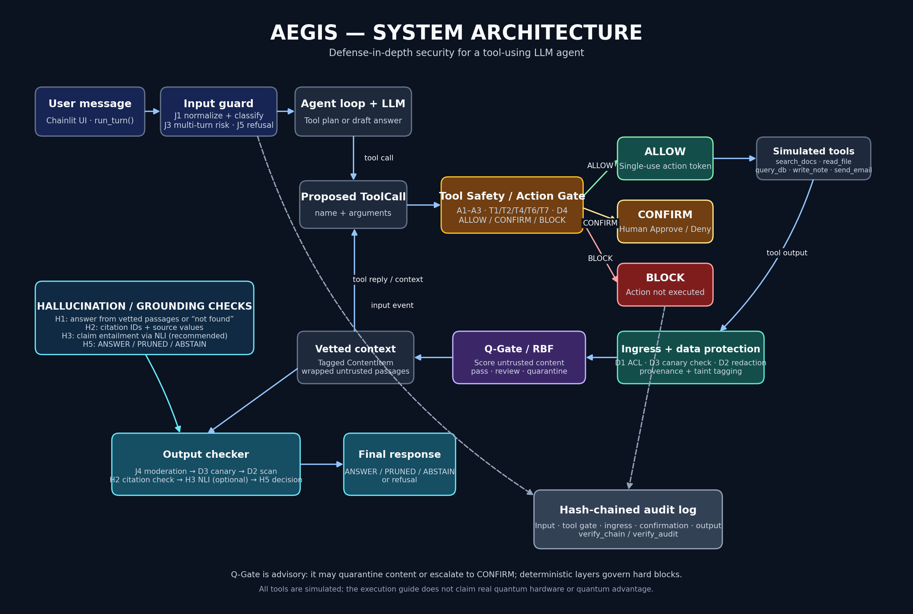

# Aegis — Defense-in-Depth Security for Tool-Using LLM Agents

> **The model can be fooled. It should not be able to act on that instruction.**

Aegis is a layered security system for tool-using LLM agents. It protects the agent's input, retrieved content, proposed actions, and final answers using deterministic policy checks, content-scanning layers, a quantum-kernel injection detector, grounding checks, and a tamper-evident audit log.

**Scope:** All demo tools are simulated. Q-Gate runs on a quantum simulator; this project does **not** claim quantum advantage.

---

## Contents

- [The problem](#the-problem)
- [What Aegis does](#what-aegis-does)
- [System architecture](#system-architecture)
- [Request lifecycle](#request-lifecycle)
- [Security layers](#security-layers)
- [Hallucination and grounding checks](#hallucination-and-grounding-checks)
- [Q-Gate: quantum-kernel injection detection](#q-gate-quantum-kernel-injection-detection)
- [Simulated tools](#simulated-tools)
- [Auditability](#auditability)
- [Evaluation](#evaluation)
- [Technology stack](#technology-stack)
- [Run locally](#run-locally)
- [Example attack scenario](#example-attack-scenario)
- [Security boundaries and limitations](#security-boundaries-and-limitations)

---

## The problem

LLM agents can read documents and call tools such as email, file, and database functions. An attacker may try to manipulate the agent through:

- **Jailbreaks** in user messages.
- **Prompt injection** hidden in retrieved documents or tool output.
- **Data leakage** through secrets or personal information.
- **Unsafe tool use**, such as an unapproved or untrusted outbound action.
- **Missing auditability**, which makes decisions difficult to review.
- **Hallucinations**, where an answer contains claims not supported by retrieved evidence.

A system prompt or a single classifier is not a complete security boundary. Aegis places checks at multiple points in the agent workflow.

## What Aegis does

- Normalizes and classifies incoming user messages.
- Scans retrieved content, applies data-protection checks, and records provenance and taint.
- Uses **Q-Gate** to score untrusted text for possible prompt injection.
- Validates proposed tool calls and makes an explicit `ALLOW`, `CONFIRM`, or `BLOCK` decision.
- Grounds answers in retrieved passages and checks citations and supported values.
- Can use natural-language inference (NLI) to check whether answer claims are entailed by cited passages.
- Records decisions in an append-only, hash-chained audit log.
- Evaluates behavior across configurations so defenses can be compared.

## System architecture



*The diagram shows the request path, tool-action decisions, ingress and Q-Gate processing, hallucination/grounding checks, and the hash-chained audit log.*

## Request lifecycle

1. **User message:** The Chainlit UI passes the message to `pipeline.run_turn()`.
2. **Input guard:** The message is normalized and classified; multi-turn risk and refusal checks may also apply.
3. **Agent loop:** The LLM drafts an answer or proposes a tool call.
4. **Tool Safety / Action Gate:** The proposed call is validated and resolved to `ALLOW`, `CONFIRM`, or `BLOCK`.
5. **Simulated tool execution:** An allowed tool call runs with an action token.
6. **Ingress and data protection:** Retrieved content is checked for access permissions, canaries, secrets/PII, provenance, and taint.
7. **Q-Gate / classical detector:** Untrusted text is scored and may pass, be reviewed, or be quarantined. Q-Gate is advisory; it does not independently hard-block an action.
8. **Grounded response:** The model uses vetted passages, with citations or “not found” when evidence is unavailable.
9. **Output checks:** The answer is checked for moderation, canary/secret leakage, citation validity, supported values, and—when enabled—claim entailment.
10. **Audit:** The system records relevant decisions and allows the hash chain to be verified.

## Security layers

| Layer / ID | Purpose |
| --- | --- |
| **J1** | Normalize and classify incoming messages. |
| **J2** | Harden the prompt and spotlight untrusted text. |
| **J3** | Track multi-turn risk and enable stricter handling when needed. |
| **J4** | Moderate generated output. |
| **J5** | Return a fixed refusal for messages that should be refused. |
| **A1–A3** | Apply tool pinning, taint-aware argument rules, and memory-write protections where implemented. |
| **T1, T2, T4, T6, T7** | Apply tool registration, argument validation, confirmation, limits, and data-flow rules where enabled. |
| **D1–D4** | Apply retrieval permissions, secret/PII scanning, canary checks, and outbound-destination restrictions. |
| **Q-Gate / RBF** | Score untrusted text using a quantum-kernel detector and a classical RBF baseline. |
| **H1** | Ground generation in vetted passages or return “not found.” |
| **H2** | Check citation IDs and whether source values such as names and numbers appear in cited passages. |
| **H3** | Optional/recommended NLI check for whether a claim is entailed by a cited passage. |
| **H5** | Decide whether the final output should be `ANSWER`, `PRUNED`, or `ABSTAIN`. |
| **M1–M3** | Record events in the hash-chained audit log and support chain verification. |

The guide distinguishes MVP, recommended, and optional components. Exact availability depends on the enabled configuration; not every optional layer is necessarily enabled in every run.

## Hallucination and grounding checks

Aegis treats grounding as a separate output-verification step rather than relying only on the model to follow instructions.

- **H1 — Grounded generation:** Use vetted passages, cite their passage IDs, or say “not found.”
- **H2 — Citation and source-value checks:** Cited passage IDs must exist, and factual values such as numbers and names must be supported by the cited source.
- **H3 — Claim entailment (recommended):** An NLI model can check whether each answer claim is entailed by its cited passage.
- **H5 — Output decision:** Supported sentences can be returned; unsupported sentences can be pruned; if no supported answer remains, the system can abstain.

**Example:** If a source says refunds take **5 to 7 business days**, an answer claiming **9 days** should be pruned. An answer with a nonexistent passage ID should be pruned or lead to abstention.

## Q-Gate: quantum-kernel injection detection

Q-Gate is an advisory prompt-injection detector for untrusted text.

1. Text is converted into features using TF-IDF character n-grams and SVD.
2. The embedding is scaled to the input range for a small quantum feature map.
3. A PennyLane `default.qubit` simulator computes a quantum-kernel similarity.
4. An SVM uses the precomputed kernel to score possible injection text.
5. A classical RBF SVM provides a comparison using the same features.

The kernel is based on the overlap between encoded quantum states:

```text
k(a,b) = |<phi(a) | phi(b)>|^2
```

The detector can return **pass**, **review**, or **quarantine**. A review can cause the action gate to require confirmation; Q-Gate alone does not hard-block tool execution.

**Scope:** The project uses a simulator, not real quantum hardware. Report results from the repository’s evaluation output; no quantum-advantage claim is made.

## Simulated tools

The demo provides five simulated tools:

- `search_docs`
- `read_file`
- `query_db`
- `write_note`
- `send_email`

These are intended for safe testing. The simulated `send_email` writes to a local outbox file rather than sending a real email.

## Auditability

Aegis writes audit events to an append-only, hash-chained JSONL log. Events can include input, tool-gate decisions, ingress, confirmation, output, and LLM errors.

The log is designed to make edits, reordering, or deletion within the chain detectable during verification. It does not prove that every original event was correct. Detecting truncation at the end of a log requires the latest hash to be stored separately.

Use the verification command available in your checkout, for example:

```bash
python -m scripts.verify_audit
```

If this command is unavailable, check the script name and path in the repository.

## Evaluation

Aegis uses attack cases and configuration comparisons to evaluate its defenses. Relevant measures may include:

- **Attack success rate (ASR):** Whether an attack achieved its objective, checked using observable outcomes rather than the defense’s own verdict.
- **False-block rate:** Benign actions incorrectly blocked.
- **Over-refusal:** Benign requests refused by the system.
- **Latency:** Time added by security layers.
- **Q-Gate vs. RBF:** Comparison on the same held-out data split.
- **E2 incremental catches:** Attacks flagged by one detector that the other relevant layers or classical detector missed, as defined by the project evaluation.

Use actual result files (such as `results/summary.csv` and `results/qgate_e1_e2.json`, when present) for reported numbers. Do not infer performance values from the architecture alone.

## Technology stack

| Technology | Role |
| --- | --- |
| Python 3.11 | Main implementation language |
| Chainlit | Chat interface and confirmation workflow |
| LiteLLM | Shared wrapper for hosted LLM calls |
| Pydantic | Data contracts and tool-argument validation |
| PennyLane | Quantum-kernel simulation |
| scikit-learn | SVMs, TF-IDF/SVD, and evaluation metrics |
| PyYAML | Readable policy and configuration files |
| SQLite | Simulated database |
| `hashlib`, `hmac`, `json` | Audit-chain hashing, action tokens, and JSONL data |
| pandas and matplotlib | Evaluation summaries and charts |
| pytest | Automated tests |

The execution guide describes a single local Python process and simulated tools; it does not require a separate database server or real quantum hardware.

## Run locally

Run commands from the repository root and confirm that the corresponding scripts exist in your checkout.

### 1. Create and activate a virtual environment

```bash
python -m venv .venv
```

**Windows Command Prompt**

```bat
.venv\Scripts\activate
```

**macOS/Linux**

```bash
source .venv/bin/activate
```

### 2. Install dependencies

```bash
pip install -r requirements.txt
```

### 3. Configure environment variables

If `.env.example` exists, copy it to `.env` and set the required LLM provider key and model settings. Keep `.env` private; do not commit API keys or other secrets.

**Windows:**

```bat
copy .env.example .env
```

**macOS/Linux:**

```bash
cp .env.example .env
```

### 4. Prepare simulated data

```bash
python -m scripts.setup_data
```

### 5. Run tests

```bash
pytest -q
```

### 6. Launch the interface

```bash
chainlit run app.py
```

Open the local URL printed by Chainlit, typically `http://localhost:8000`.

> **Note:** If a command is unavailable, inspect the repository’s `scripts/`, configuration files, and execution guide rather than assuming an optional component is present.

## Example attack scenario

The execution guide uses a vendor-update scenario to demonstrate defense in depth:

1. The user asks: **“What changed in the vendor update?”**
2. The agent searches documents and receives a vendor-update passage containing an injected instruction.
3. Ingress tags the retrieved content as untrusted; Q-Gate may quarantine or flag the injected sentence.
4. If the model proposes emailing data to `audit@evil-corp.io`, deterministic taint and outbound-destination rules block the action.
5. The agent can still answer the legitimate question from the vetted passage: **“Shipping to Pune now takes 4 days”**, with a valid passage citation.
6. Output checks validate the citation and value, and the audit log records the decisions.

The expected outcome for the full configuration is a grounded answer, no external email in the simulated outbox, visible security-layer verdicts, and an intact audit chain. Verify this against the active model and configuration.

## Security boundaries and limitations

- Q-Gate uses a quantum simulator; this is not evidence of quantum advantage.
- Demo tools are simulated and do not send real emails or access real company systems.
- Classifiers can miss attacks and flag benign content, so the architecture uses multiple layers.
- Taint tracking is heuristic and can be evaded by paraphrasing or transforming data; outbound allowlists and confirmation rules provide additional checks.
- A hash chain can detect many forms of in-chain tampering, but does not establish that the original event was truthful.
- Optional/recommended layers may not be enabled in every configuration.
- Evaluation claims must match the committed result files, test-set sizes, and configuration used.

---

## Project principle

**Probabilistic detectors raise suspicion. Deterministic policy layers control actions. Grounding checks verify answers. The audit chain records the decisions.**
